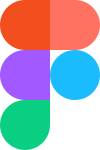

  

  

<h2 align="center">Hi there 👋, I'm Yaroslav!</h2>

Languages and Tools:

  <code>
    
  </code>
  <code>
    
    </code>
  <code>
    
  </code>
  <code>
    
  </code>
  <code>
    
  </code>
  <code>
    
  </code>
  <code>
    
  </code>
  <code>
    
  </code>

  

<!--
**YK911/YK911** is a ✨ _special_ ✨ repository because its `README.md` (this file) appears on your GitHub profile.

Here are some ideas to get you started:

- 🔭 I’m currently working on ...
- 🌱 I’m currently learning ...
- 👯 I’m looking to collaborate on ...
- 🤔 I’m looking for help with ...
- 💬 Ask me about ...
- 📫 How to reach me: ...
- 😄 Pronouns: ...
- ⚡ Fun fact: ...
-->
